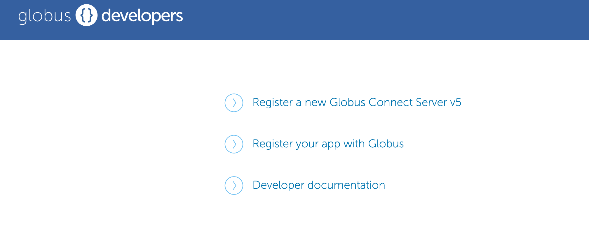
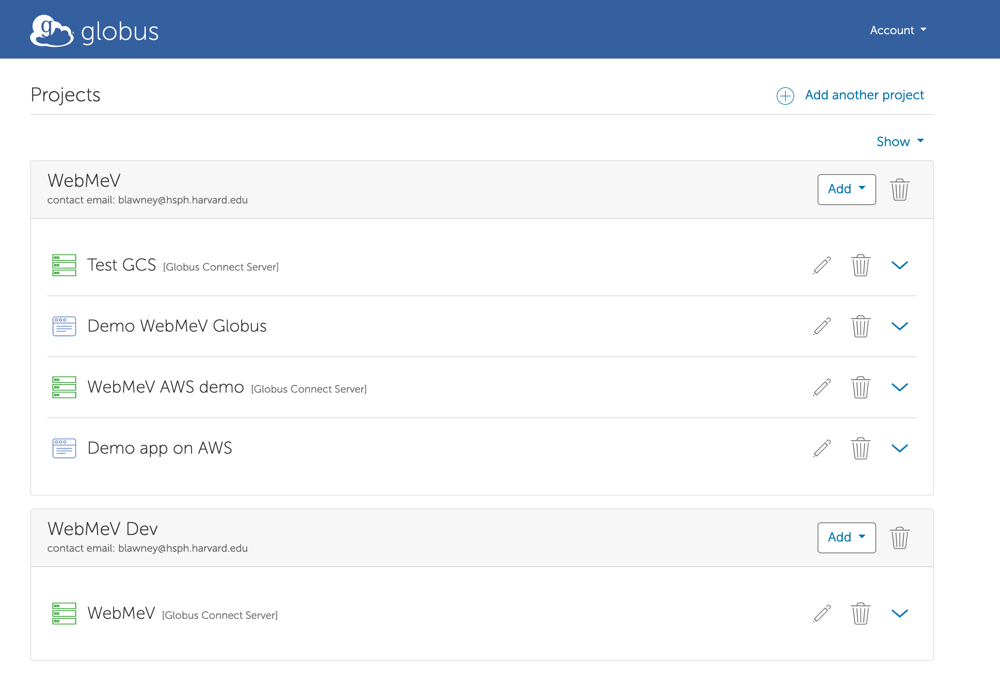
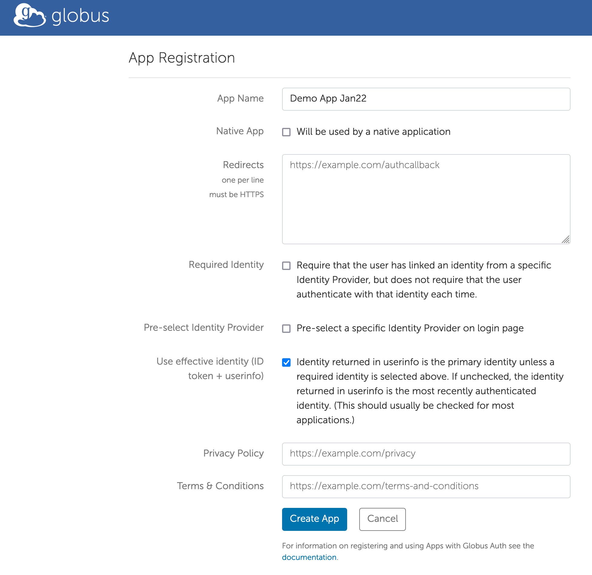
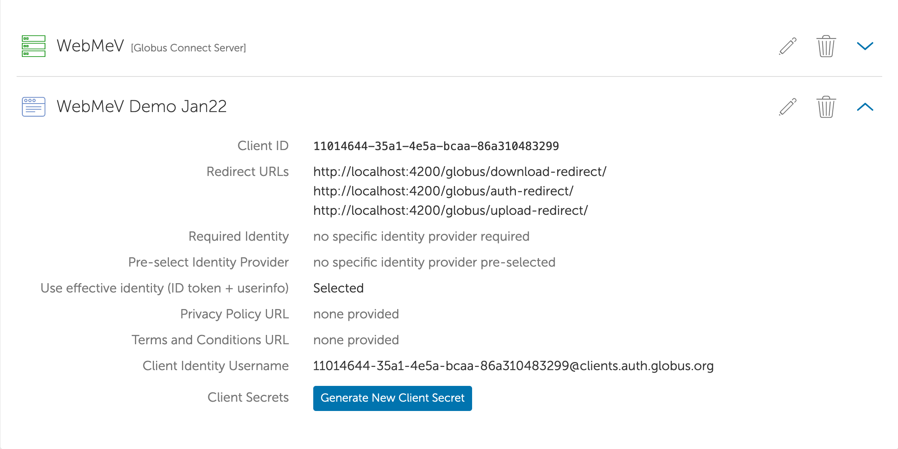

## Configuring Globus for use with WebMeV

Note that the initial Globus endpoint and transfer node setup is a manual process. After this has been completed, configuration files can be saved, which will enable future deployments without any manual configuration. To avoid conflicts, this process needs to be repeated for each deployment you plan to create.

In the end, you will need the following items saved **before** you destroy the infrastructure:
- the deployment key, which is a JSON file typically named `deployment-key.json`
- the node configuration, which is a JSON file created towards the end of the process.

Make sure those are saved (and not added to version control!) before you destroy your temporary EC2 instance used below.

### Initial setup

To create the initial configuration, you will need to do the following:

- Create an S3 bucket that Globus will use. Files can be read and written here by Globus. The WebMeV deployment process will also create this bucket, but here we use it as a means to test the manual setup. It will be destroyed at the end.
    - As seen in `storage.tf`, we expect a deployment-specific bucket named `<stack>-webmev-globus` where `<stack>` is the name of the terraform workspace. *Name your bucket to follow this convention.*
- Create an IAM user and access keys 
    - The name does not matter, but name it so it's clearly associated with your deployment stack, so as not to accidentally delete the IAM user in the case of multiple deployments.
    - The IAM user will be *permanent*. Otherwise, the Globus app will require manual configuration each time to update the user-associated key/secret.
- Create a bucket policy and associate it with that IAM user. Replace `<BUCKET NAME>` with the bucket created above:
```
{
    "Version": "2012-10-17",
    "Statement": [
        {
            "Sid": "AllBuckets",
            "Effect": "Allow",
            "Action": [
                "s3:ListAllMyBuckets",
                "s3:GetBucketLocation"
            ],
            "Resource": "*"
        },
        {
            "Sid": "Bucket",
            "Effect": "Allow",
            "Action": [
                "s3:ListBucket",
                "s3:ListBucketMultipartUploads"
            ],
            "Resource": "arn:aws:s3:::<BUCKET NAME>"
        },
        {
            "Sid": "Objects",
            "Effect": "Allow",
            "Action": [
                "s3:GetObject",
                "s3:PutObject",
                "s3:DeleteObject",
                "s3:ListMultipartUploadParts",
                "s3:AbortMultipartUpload"
            ],
            "Resource": "arn:aws:s3:::<BUCKET NAME>/*"
        }
    ]
}
```
- Create an EC2 instance to host the Globus Connect Server (GCS)
    - The instance requires some specific configuration, such as opening of ports 443 and 50000-51000. Consult the [Globus documentation](https://docs.globus.org/globus-connect-server/v5.4/#globus_connect_server_prerequisites) for more details. You can also consult `globus.tf` for configuration details on instances that will match those of the WebMeV deployment. The instance type does not need to be large, so t2.small or similar should be fine.

**As a reminder, you will need to keep the IAM user (+ keys) and associated policy**. The bucket and EC2 instance can be deleted following the setup process, once we have the configuration files copied to a safe location.


---

### Configuring the GCS Endpoint

The official reference for setting up the GCS endpoint can be found at https://docs.globus.org/globus-connect-server/v5.4/

- Go to [developers.globus.org](developers.globus.org) to register a new GCS instance. For this, you will need to login with some Globus-associated entity (for myself, it was using a Harvard-associated ID). After logging in, select your project (or create a new one) and choose "Add new Globus Connect Server" from the dropdown. Eventually, you will be presented with a screen where you can view the client ID and generate a client secret. Save these.

- Open a shell on the EC2 instance and elevate permissions (`sudo -s`)

- Set up the Globus endpoint (see Globus docs ):
```
$ globus-connect-server endpoint setup "<NAME>" \
    --organization <organization name> \
    --client-id <CLIENT ID> \
    --owner <OWNER ID> \
    --contact-email <EMAIL ADDRESS>
```
`<NAME>` is some descriptive name for this GCS endpoint. The `<CLIENT ID>` is the GCS client ID created above. The `<OWNER ID>` is the entity with which you logged into Globus above. The email address is simply a contact and can be anything. This command prompts for the client secret and then asks if you agree to the LetsEncrypt TOS.

After LetsEncrypt completes, you will be presented with an auth.globus.org link to perform an OAuth2 flow. Copy/paste the code back to the terminal.

**This creates `deployment-key.json` in the current working dir. Copy/save that to your machine. You will need this for future deployments.**

Next, set up the Data Transfer Node (DTN):
```
$ globus-connect-server node setup --client-id <CLIENT ID>
```
This will also prompt for your client secret. When complete, it will ask that you run the following to restart the server:

```                                    
$ systemctl restart apache2
```

Next, we log in, which makes us perform another OAuth2 flow:
```
$ globus-connect-server login localhost
```
which will (again) present a link to perform an OAuth2 flow.

Next, print the endpoint info to confirm:
```
$ globus-connect-server endpoint show
Display Name:    <NAME>
ID:              <ENDPOINT UUID>
Subscription ID: <None or subscription ID>
Public:          True
GCS Manager URL: https://<URL PREFIX>.data.globus.org
Network Use:     normal
Organization:    <ORG>
Contact E-mail:  <EMAIL>
```
If the "subscription ID" is `None` above, you will need to request that the endpoint be added to a Globus subscription to enable the S3 connector functionality. This can be done by contacting Globus support.


Now create the storage gateway (see [https://docs.globus.org/globus-connect-server/v5/reference/storage-gateway/create/s3/](https://docs.globus.org/globus-connect-server/v5/reference/storage-gateway/create/s3/)) for more info:
```
globus-connect-server storage-gateway create s3 \
    "<GATEWAY NAME>" \
    --domain harvard.edu \
    --s3-endpoint <AWS S3 API URI> \
    --s3-user-credential \
    --bucket <BUCKET NAME> \
    --high-assurance \
    --authentication-timeout-mins 60
```
which reports the storage gateway ID. 

Quick notes about these args:
- `--bucket` is the name (without the `s3://` prefix) of the Globus bucket (the one for which we set the bucket policy above)
- `--domain` arg restricts access to users under the specified domain (e.g. "harvard.edu" only allows Harvard-associated Globus identities) 
- `--s3-endpoint` is the region-specific URI of the AWS S3 API, e.g. `https://s3.us-east-2.amazonaws.com` for the `us-east-2` region.


Now create a collection [https://docs.globus.org/globus-connect-server/v5/reference/collection/create/](https://docs.globus.org/globus-connect-server/v5/reference/collection/create/):

```
globus-connect-server collection create \
    <STORAGE GATEWAY ID> \
    <BASE PATH> \
    <DISPLAY NAME> \
    --allow-guest-collections
```
which reports a collection ID. Note that the `--allow-guest-collection` flag provides the ability to create the guest collections which allow third-parties to add files to the collection. This is the mechanism by which WebMeV users will upload their files via Globus. Also note that `<BASE PATH>` is best set to the name of your bucket (e.g. `/<your bucket name>`). 

Next, go to the [app.globus.org](app.globus.org) site and log in. From there, search for the `<DISPLAY NAME>` from the `collection create` command above. 

Click on the collection and then follow the instructions if prompted. If there is no prompt, click on the "Credentials" tab. This should allow you to add the AWS IAM key/secret for the Globus user we created at the start. You will be asked to approve various actions by the Globus application. 

At this point, you should be able to upload to this collection. To test, navigate to this collection, click on "File manager" and search for your collection. Then click the "upload" button (which might require additional confirmations). Choose a file and confirm. After the upload is complete, you should be able to see the file in your bucket. This confirms that Globus can work with your bucket.

If that works, your GCS endpoint is ready. However, the work is not done-- we still need to configure everything for WebMeV to interface with Globus.

---

### Configuring the WebMeV Globus application

At this point, we have a GCS that can communicate and place files in our bucket. We now need to get it to work with the web application. The web application will manage third-party access to a shared Globus collection. We first create the web application since we will need to assign the application client privileges on the "guest collection" we create later.

First go to [developers.globus.org](developers.globus.org) site and click "Register your app with Globus"):


This will take you to a page where you can view your Globus projects; add it to the project you used/created when setting up the endpoint. Click the "Add" driopdown and select "Add new app":



Next, enter the information about the application. In particular, ensure the callback URLs are appropriate. These URLs should correspond to the *frontend instance*, NOT the backend. The backend will handle the OAuth2 flow, but is largely orchestrated by the frontend.

TODO: ADD URLS ONCE IMPLEMENTED




After this, you should see the following:



**Save the application client ID/secret to your local machine. You will need this for the terraform variables.**


### Adding the guest collection

Follow the directions at [https://docs.globus.org/how-to/share-files/](https://docs.globus.org/how-to/share-files/); be sure to login using the same identity used to create the endpoint and application. Search for the collection we created earlier; recall the collection was named by the `<DISPLAY NAME>` arg to `globus-connect-server collection create` above. 

Note that in step 5 of the linked instructions, you will select "user" and enter the "email-like" identifier of the web application you created above (e.g. `<web app client id>@clients.auth.globus.org`)

### Exporting the DTN configuration

After setting up the guest share above, we can list the collections associated our endpoint by logging onto the GCS host and running the following (which will likely require a login to localhost as shown above):
```
$ globus-connect-server collection list
ID        | Display Name             | Owner          | Collection Type | Storage Gateway ID                  
--------- | ------------------------ | -------------- | --------------- | -------------------
<UUID 1>  | <COLLECTION NAME>        | <GLOBUS OWNER> | mapped          | <GATEWAY UUID 1>
<UUID 2>  | <SHARED COLLECTION NAME> | <GLOBUS OWNER> | guest           | <GATEWAY UUID 2>
```
This is a helpful confirmation that the endpoint and "guest" collection are properly associated.

Now run:
```
$ globus-connect-server node create \
    --client-id "<GCS UUID>" \
    --export-node node_config.json
```
which will prompt for the client secret. The ID and secret here are the ones for the GCS endpoint, *not* the web application. Note that the name of the `--export-node` arg does not matter. However, when we use that file for WebMeV deployments, we expect a name following a particular convention; see [below](#saving-the-files) for where to persist this file.

**Copy and save the `node_config.json` file created above.**

---

### Saving the files

The Globus GCS host provisioning script expects the deployment key and node configuration files to be located at:

```
s3://webmev-tf/secrets/<DEPLOYMENT>/deployment-key.json
s3://webmev-tf/secrets/<DEPLOYMENT>/node_config.json
```
where `<DEPLOYMENT>` is the name of the terraform workspace. Upload your files to the appropriate location; change the bucket name as necessary to match your deployment.

---

### Destroying the infrastructure

Before you remove the bucket and EC2 instance, ensure you have saved both:
- deployment-key.json
- node_config.json

You can now delete both the bucket and the EC2 instance. Recall that you need to keep the IAM user and associated keys.


### Modifying the associated bucket

If you encounter a situation where you need to change the bucket associated with Globus, you can perform the following steps. For instance, we had an existing association for one stack `foo` (and hence associated with `s3://foo-webmev-globus`) and want to change it to `bar` (and bucket `s3://bar-webmev-globus`).

First, if it does not already exist, create the IAM user and associated bucket policy, as described at the top of this document. Also generate an access key/secret for this user

Then:
- Log onto the existing GCS VM (i.e. `foo-mev-gcs` EC2 instance)
- `sudo -s`
- Log in and perform the OAuth2 flow using `globus-connect-server login localhost`
- Get the current storage gateway ID using `globus-connect-server storage-gateway list`
- List current collections with `globus-connect-server collection list`
- Delete the existing collections with `globus-connect-server collection delete <ID>` (for each)
- Delete the storage gateway `globus-connect-server storage-gateway delete <ID>`
- Create a new S3 storage gateway and proceed with all the steps above for:
    - create a new collection
    - Add AWS keys to the collection in the Globus web app
    - Create a guest collection
- In the end, don't forget to export the node config and save in the proper bucket.