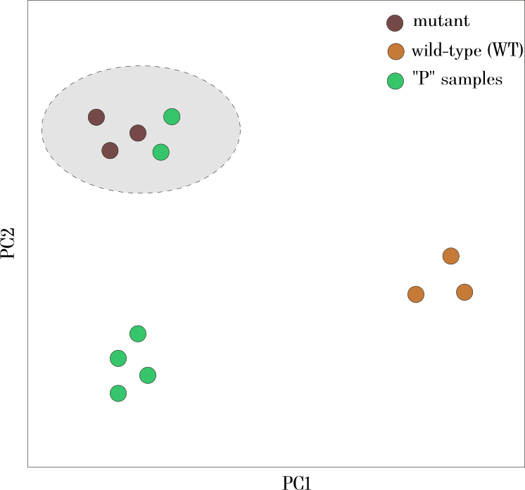

### About Workspace metadata

As described elsewhere, all analyses occur in the context of a user's `Workspace`; the `Workspace` allows users to organize files and analyses logically. To operate on the potentially multiple files contained in a user's `Workspace`, we are obligated to track metadata that spans across the data resources and is maintained at the level of the user's `Workspace`. We are typically required to provide this metadata to analyses/`Operation`s, including information about samples (`Observation`s), genes (`Feature`s), and possibly other annotation data.

A `Workspace` can have multiple file/`Resource` objects associated with it, each of which has its own unique metadata. Therefore, we conceive of "workspace metadata" which is composed from the *union* of the individual `Resource`'s metadata.

Consider two `Resource` instances in a `Workspace`. The first (`Resource` "A") is data generated by a user and has six samples, which we will denote as S1,...,S6; S1-S3 are wild-type and S4-S6 are mutant. The `ObservationSet` associated with `Resource` A could look like:
```
{
    "multiple": true,
    "elements": [
        {
            "id": "S1",
            "attributes": {
                "genotype": "WT"
            }
        },
        ...
        {
            "id": "S6",
            "attributes": {
                "genotype": "mutant"
            }
        }
    ]
}
```


The other (`Resource` B) is public-domain data and also has six samples, which we will denote as P1,...,P6. The `ObservationSet` associated with `Resource` B could look like:
```
{
    "multiple": true,
    "elements": [
        {
            "id": "P1",
            "attributes": {}
        },
        ...
        {
            "id": "P6",
            "attributes": {}
        }
    ]
}
```
(Note that for simplicity/brevity these samples don't have any annotations/attributes for this example).

Now, as far as the `Workspace` is concerned, there are 12 `Observation` instances by performing a union of the `Observation`s contained in the `ObservationSet` associated with each `Resource`. 

In the course of performing an analysis, the user might wish to create meaningful "groups" of these samples. Perhaps they merge the two count matrices underlying `Resource`s A and B, and perform a principal component analysis (PCA) on the output. They then note a clustering of the samples which they perceive as meaningful:



(Via the dynamic user interface, we imagine the user selecting the five samples in the grey ellipse-- two of the public "P" samples, P3 and P4 cluster with the WT samples). They can then choose to create a new `ObservationSet` from those five samples: 

```
{
    "multiple": true,
    "elements": [
        {
            "id": "S4",
            "attributes": {
                "genotype": "mutant"
            }
        },
        {
            "id": "S5",
            "attributes": {
                "genotype": "mutant"
            }
        },
        {
            "id": "S6",
            "attributes": {
                "genotype": "mutant"
            }
        },
        {
            "id": "P3",
            "attributes": {}
        },        
        {
            "id": "P4",
            "attributes": {}
        }
    ]
}
```
This information regarding user-defined groupings can be cached client-side. However, the ultimate "source" of the metadata is provided by the `Workspace`, which maintains the `ObservationSet`s, `FeatureSet`s, and possibly other metadata.

[//]: <> (We could use a heatmap to visualize how users have created various selections:)


### Using the metadata for analyses

After the user has created their own `ObservationSet` instances, they can use them for analyses such as a differential expression analysis. For instance, the inputs to such an analysis would be an expression matrix (perhaps the result of merging the "S" and "P" samples/`Observation`s) and two `ObservationSet` instances. The payload to start such an analysis (sent to `/api/operations/run/`) would look something like:

```
{
    "operation_id": <UUID for Operation>,
    "workspace_id": <UUID for Workspace>,
    "inputs": {
        "count_matrix": <UUID for merged Resource>,
        "groupA": <ObservationSet with S4,S5,S6,P3,P4>,
        "groupB": <ObservationSet with S1,S2,S3,P5,P6>
    }
}
```

### Additional user-supplied metadata

Finally, the users might want to add additional annotations to their metadata. For instance, assuming we still are working with `Resource` instances A and B, we could upload an additional `Resource` with type "ANN" (for *ann*otation) and add it to this `Workspace`. For instance, maybe it looks like:

| sample | sex | p53_mutant_status |
|--------|-----|-------------------|
| S1     | M   | 1                 |
| S2     | F   | 0                 |
| S3     | F   | 0                 |
| S4     | F   | 1                 |
| S5     | M   | 1                 |
| S6     | M   | 0                 |

This would then incorporate into the existing `Observation` instances so they now would look like:
```
{
    "multiple": true,
    "elements": [
        {
            "id": "S1",
            "attributes": {
                "genotype": "WT",
                "sex": "M",
                "p53_mutant_status": 1
            }
        },
        ...
        {
            "id": "S6",
            "attributes": {
                "genotype": "mutant",
                "sex": "M",
                "p53_mutant_status": 0
            }
        }
    ]
}
```

[//]: <> (Unsure how this might work on the front-end in terms of updating the `Observation` instances so that they all have this information. If the `ObservationSet` was setup to have pointers/references to the `Observation` instances then the changes could percolate to all the `ObservationSet` instances.)

### Backend endpoints

To provide a "single source of truth", there will be a "workspace metadata" endpoint at `/api/workspace/<UUID>/metadata/` which will track the *union* of all the `Resource` metadata in the `Workspace`. To reduce the amount of data returned, there will also be specific endpoints for `Observation`s and `Feature`s at `/api/workspace/<UUID>/metadata/observations/` and `/api/workspace/<UUID>/metadata/features/`.

The front-end will maintain the various user selections (formerly "sample sets", now `ObservationSet`) but the full set of available `Observation` instances will be kept on the backend.

Using the example above, a request to `/api/workspace/<UUID>/metadata/observations/` would return:

```
{
    "multiple": true,
    "elements": [
        {
            "id": "S1",
            "attributes": {
                "genotype": "WT",
                "sex": "M",
                "p53_mutant_status": 1
            }
        },
        {
            "id": "S2",
            "attributes": {
                "genotype": "WT",
                "sex": "F",
                "p53_mutant_status": 0
            }
        },
        {
            "id": "S3",
            "attributes": {
                "genotype": "WT",
                "sex": "F",
                "p53_mutant_status": 0
            }
        },
        {
            "id": "S4",
            "attributes": {
                "genotype": "mutant",
                "sex": "F",
                "p53_mutant_status": 1
            }
        },
        {
            "id": "S5",
            "attributes": {
                "genotype": "mutant",
                "sex": "M",
                "p53_mutant_status": 1
            }
        },
        {
            "id": "S6",
            "attributes": {
                "genotype": "mutant",
                "sex": "M",
                "p53_mutant_status": 0
            }
        },
        {
            "id": "P1",
            "attributes": {}
        }, 
        {
            "id": "P2",
            "attributes": {}
        },
        {
            "id": "P3",
            "attributes": {}
        },        
        {
            "id": "P4",
            "attributes": {}
        },
        {
            "id": "P5",
            "attributes": {}
        },
        {
            "id": "P6",
            "attributes": {}
        },
    ]
}
```