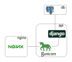

## The MEV application cluster

This section of the installation instructions describes:
- How to set up a new host for WebMEV
- Basic host machine configuration
- Starting WebMEV on the host, regardless of your hardware

### Creating a host machine

*Note: If you wish to run WebMEV as a local application (i.e. not using a cloud provider), you may skip this section.*

**Starting the machine**
Using the instructions specific to your cloud platform, start a new virtual machine. Note that we have only run WebMEV on a Debian-based Linux system and do not plan to support other operating systems. However, by using Docker, we anticipate that WebMEV *should* be portalbe to any system capable of running Docker.

There is relatively little that is specific to WebMEV about this process, but we make note of the following considerations:

- **Ports:** The public-facing nginx server used by MEV expects both 80 (for http) and 443 (for https) to be open, although the choice of protocol is up to you.

- **Disk size:** In addition to the application itself, the host machine will maintain a temporary cache of user data and any Docker images used to run local Docker-based jobs. Choose your disk size to accommodate this anticipated load.

- **Processor/RAM requirements:** The resource requirements for WebMEV itself are not substantial, but you should aim to size your VM to successfully handle your most resource-intensive analyses. Recall that local Docker-based jobs will consume resources of the host machine, so you should have some idea of the resources required for each type of analysis that you plan to run using the local Docker-based job runner. We advise at least 4vCPU and >8Gb RAM, although this may change as we see additional stress or more intensive analysis requirements. 

In theory, one could execute large, resource-intensive alignment jobs using the local Docker-based job engine, but this would incur substantial costs for maintaining a large on-demand virtual machine. Thus, we advise that local Docker-based jobs have relatively small resource requirements and larger, resource and time-intensive tasks be implemented to make use of the remote job runners such as Cromwell.

### Software requirements of the host machine

WebMEV uses `docker-compose` and thus requires that both `Docker` and `docker-compose` are installed on the host system. Refer to the respective projects for installation instructions.

Other requirements include `git` and your favorite text editor.

### Cloning and starting the application

The WebMEV application is architected as a collection of Docker images which is orchestrated/managed by `docker-compose`.  As mentioned previously, you will need to have Docker and docker-compose installed.

The application includes three containers with the following responsibilities.
- `nginx`: Handles communication to the outside world. Serves static files directly and forwards other requests to the application server (gunicorn), which is packaged in the `api` container.
- `db`: The database container. Currently using postgres as we require saving of JSON-format data structures
- `api`: The main application container. This container wraps several components, including the web application (written in Django), redis for cache and job queueing, and gunicorn as the application server.



First, we clone the repository locally:
```
git clone https://github.com/web-mev/mev-backend.git
```

**Setting the required environment variables**
Regardless of whether you are running in development or production, mode, you will need to supply various environment variables to properly configure WebMEV. In the root of the repository is a file named `env_vars.template.txt`.  Edit that with usernames, passwords, etc. as necessary.

For more detailed information on configuration, see [Configuration](setup_configuration.md)

**To start the application in local *development* mode:**

In development mode, the application server (gunicorn) does not start automatically as the container starts.  Rather, all the containers are started but the application container (named `api`) remains idle.  This allows us to mount a local directory where we can dynamically edit the code and immediately see changes without having to rebuild the entire cluster.  

**Note that the Django `DEBUG` argument is set to `True` in this dev mode, so be mindful of this if the server is exposed to the public/internet.**

Development mode requires you to have a file containing your environment variables that is named `env_vars.dev.txt`. Thus, copy the file and edit with your passwords and other info:
```
cp env_vars.template.txt env_vars.dev.txt
# edit env_vars.dev.txt as necessary
```

Now we can start the docker-compose cluster. Run:
```
docker-compose up -d --build
```
This builds all the containers and runs in "detached" mode (`-d`).  By default, `docker-compose` will look for the `docker-compose.yml` file which, by design, puts us in *development* mode.  The current directory on the host machine (the directory where the MEV repository was cloned) will be mounted at `/workspace` inside the `api` container.

Next, enter the container with:
```
docker-compose exec api /bin/bash
```
You may optionally choose to add the `-u 0` flag which logs you into the `api` container as root.

Once inside, run the following:
```
cd /workspace/mev
source startup_for_local_dev.sh
```
This will run some database migrations and other preliminaries, but will **not** actually start the gunicorn application server.  To do that, you must then run:
```
cd /workspace/mev
gunicorn mev.wsgi:application --bind 0.0.0.0:8000
```
(note the `cd` at the top since the `startup.sh` script ends up moving you into the `/www` directory).  The `bind` argument should have the port set to 8000 as this is how the NGINX container communicates over the internal docker-compose network.

Following all that, **the application should be running on port 8081** (e.g. http://127.0.0.1:8081/api/)


If you are interested, note that additional gunicorn configuration parameters can be specified (see https://docs.gunicorn.org/en/latest/configure.html). 

By stopping the gunicorn server (Ctrl+C), you can make local edits (i.e. on your host machine) to your code (which is, again, available within the container via the volume mount) and immediately restart the server to see the changes.  The unit test suite can also be run in this manner with
```
python3 /workspace/mev/manage.py test
```

**To start the application in *production* mode:**

In production mode, the application server *will* be started following the usual startup steps contained in `mev/startup.sh`.

In the root of the repository (where the `docker-compose.prod.yml` file resides) run:
```
docker-compose -f docker-compose.prod.yml up -d --build
```

This should start everything up.  On occasion, if you are very quick to navigate to the site, NGINX will issue a 502 bad gateway error.  However, a refresh or two should eventually reach the site as expected.  

In production mode, Django debugging is turned off, so any errors will be reported as generic 500 server errors without any corresponding debug details.

 ### Stopping the application

To shut down the application (in verbose mode), run
```
docker-compose down -v
```

### Restarting only the application container

If you need to update the API code and wish to preserve the remainder of the application, such as database rows, etc. then you can update the `api` container independently. On the host machine, run: 

```
docker-compose -f docker-compose.prod.yml up --build --force-recreate --no-deps -d api
```

Of course updates to the database structure will require database migrations, which is challenging if you wish to maintain the existing rows. We do not cover that here.