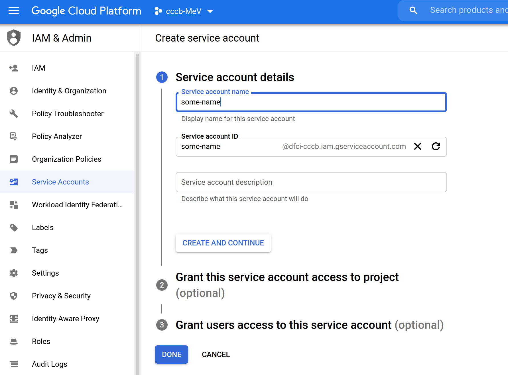
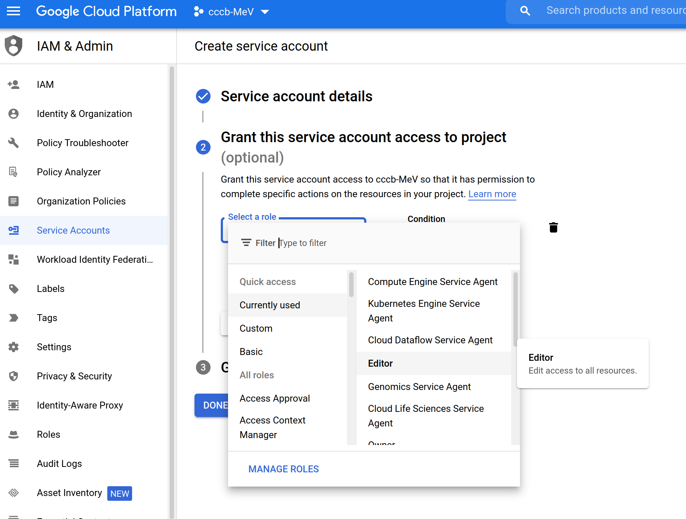
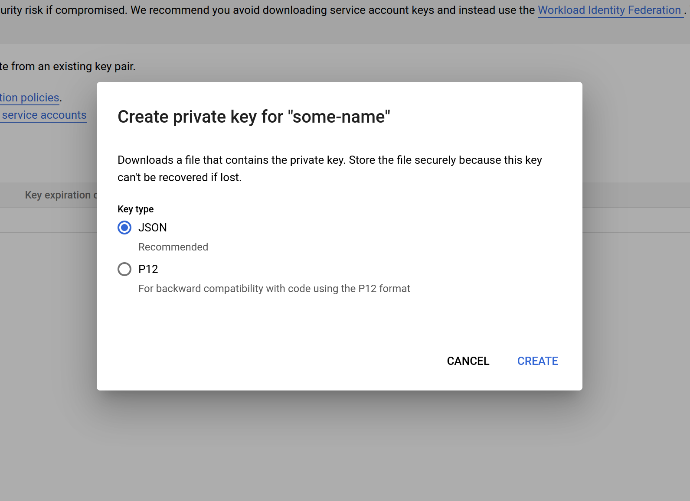

## The WebMEV API

This section of the installation instructions describes:

- Creation of a local development stack using Vagrant
- Creation of a cloud-based stack

---

As described in the general architecture section, WebMEV consists of two servers: the main Django-based application server and the remote job scheduler (Cromwell). 

The application server consists of a production web server (nginx), an application server (gunicorn), the Django-based application, and a database. The database can be implemented locally (when in the local, Vagrant-based build) or with a cloud-based instance (when deploying on a cloud platform). Regardless of the implementation of the database server, Django communicates with the database via a unix socket on the VM.


---

### Local development using Vagrant


- Install [Git](https://git-scm.com/), [VirtualBox](https://www.virtualbox.org/), and [Vagrant](https://www.vagrantup.com/)
- Clone the WebMEV backend repository: `git clone https://github.com/web-mev/mev-backend.git`
- Change into the repository directory: `cd mev-backend`
- Copy the template file for the environment variables you will need: `cp vagrant/env.tmpl vagrant/env.txt`. Note that the name/path of the file is important since the provisioning script makes reference to a file at this path.
- Fill in the proper environment variables in that copied file (e.g. `vagrant/env.txt` above). Note that for local dev like unit testing, many of the variables can be left as-is. However, if you would like to test the integration with dockerhub, gmail, then
you can certainly fill-in those variables.
- Provision and start the VM: `vagrant up`
- SSH into the VM: `vagrant ssh`

You are now ready to develop locally. Note that the code is shared between the host and VM at the `/vagrant` directory.

**To run unit tests**
```
cd /vagrant/mev
python3 manage.py test
```
(use the `--failfast` flag if you want to fail the test suite on the first failure encountered)

**To run the application locally**
By default, the provisioning script does not start the gunicorn application server. To do that, simply run:
```
sudo supervisorctl start gunicorn
```
(Note that you need to use elevated privileges since you are interacting with the supervisor daemon. Otherwise you will get a permission error.)

---

### Deploying to GCP using terraform

The GCP deployment includes two virtual machines, a managed cloud-based database, and several network services. In particular, we employ a public-facing load balancer which obviates the need for configuring and managing SSL certificates on the individual VMs. Instead, the load balancer and Google-managed SSL certificates (with HTTPS forwarding rules) provide secure connections to WebMeV.

In addition to having a GCP account, this deployment strategy assumes:

- You have a custom domain you wish to use
- You will only allow HTTPS connections (HTTP will be upgraded to HTTPS)
- You have already created a "managed zone" in GCP's Cloud DNS and your domain registrar is using the Cloud DNS nameservers. Note that Cloud DNS is NOT the same as Google Domains, if that happens to be your domain registrar. We do this since the terraform script dynamically creates DNS records which will point at the load balancer IP.

These items are obviously not *required*, but you would need to modify the terraform scripts.

**To deploy**

- Install [Google Cloud SDK](https://cloud.google.com/sdk/docs/install) and [Terraform](https://www.terraform.io/downloads.html)
- Create a service account with the appropriate roles and obtain a JSON-format service account key file. You can do this via the [gcloud commandline tool](#gcloud-svc-acct) or using the [web console](#gcp-svc-acct). Keep the key file safe.
- To allow https, we need an SSL certificate. The `gcloud` commandline tool provides a convenient way to provision one:
```shell
gcloud beta compute ssl-certificates create <CERTIFICATE NAME>
--description="SSL certificate for WebMeV dev server"
--domains="mev-api.example.org"
```
Note: until the full stack is up and the load balancer is active, this will remain in a "provisioning" state; specify only the backend domain in the above command.

- `cd deploy/terraform/live`
- `terraform init`
- `cp config.tfvars.template terraform.tfvars`
- Edit `terraform.tfvars` to assign required configuration values. You can refer to the `vars.tf` file for explanations of these variables and what they do. These are obviously the same environment variables used in the local, Vagrant-based deployment, so further information may be available in the comments of the `vagrant/env.tmpl` file at the root of this repository.

  **Special notes:**
  - The `ssl_cert` variable refers to the SSL certificate you created above. It is a resource string like: `projects/<GCP PROJECT>/global/sslCertificates/<CERTIFICATE NAME>`
  - The `credentials_file` variable is the JSON-format key file you obtained for your service account. Assuming you saved this file in your `deploy/terraform/live/` directory, then you can simply write the file name.
  - The `service_account_email` variable is the email-like name of the service account you created. For example, `abc123@<GCP PROJECT>.iam.gserviceaccount.com`

- Create and set your terraform workspace.
  Note that we make use of [terraform workspaces](https://www.terraform.io/docs/language/state/workspaces.html) which allow independent deployments using the same scripts. The *name* of the workspace is typically used when naming the cloud-based resources created (e.g. `backend-<WORKSPACE NAME>`) to make them more obvious when interacting with the GCP console or gcloud tool. By default, the workspace name is, appropriately enough, `default`. You can create a new workspace with:
```
terraform workspace new <WORKSPACE NAME>
```
and you can switch between workspaces with:
```
terraform workspace select <WORKSPACE NAME>
```

- Once you have set a workspace, you can build it with
```
terraform apply
```
This will prompt for any configuration variables that were not included in `terraform.tfvars`. Often, variables like these are intentionally left out to force the user to take a moment and think about what they are doing. One example is the git commit ID. This will tell terraform which git commit should be deployed. We intentionally prompt for this so that the developer is forced to examine the *exact* version of the application they wish to deploy.
- To delete your resources:
```
terraform destroy
```
---

<a name="gcp-svc-acct">**Creating a service account with the GCP console**</a>

- Navigate to "IAM & Admin" --> "Service Accounts":
[](gcp_service_account_1.png)

- Click the "create service account" button at the top:

[](gcp_service_account_2.png)

- Give the account a name:
[](gcp_service_account_3.png)

- Add "roles" to this service account. To work with the deployment, you will need:
    - Editor (`roles/editor`)
    - Service Networking Admin (`roles/servicenetworking.networksAdmin`)

[](gcp_service_account_4.png)

- After the account is created, you will be directed to the page with all the service accounts for your your GCP project. Click on the one you  just created:
[](gcp_service_account_5.png)

- Go to the "keys" tab and create a new JSON key:
[](gcp_service_account_6.png)
[](gcp_service_account_7.png)

- Save this key in your `deploy/terraform/live/` folder. Then the `terraform.tfvars` file can reference this file easily.

<a name="gcloud-svc-acct">**Creating a service account with the gcloud tool**</a>

- Create a service account:
```
gcloud iam service-accounts create <NAME> --display-name="<SOME NAME>"
```
e.g. 
```
gcloud iam service-accounts create abc123 --display-name="A basic name"
```
 The identifier "abc123" below will create a service account with a "full" email-like name, e.g. `abc123@myproject.iam.gserviceaccount.com`. The name needs to conform to some basic requirements (minimum length, characters) and gcloud will warn you if you it doesn't comply.

- Add the appropriate policies to this service account. This will enable the account to perform certain actions like creation of VMs, etc. Specifically, you will need to add the `roles/editor` and `roles/servicenetworking.networksAdmin` to your service account. The latter will enable your application server to connect to the cloud-based database. Project "editor" permissions alone will not be adequate.
```
gcloud projects add-iam-policy-binding myproject \ 
    --member='serviceAccount:abc123@myproject.iam.gserviceaccount.com' \ 
    --role='roles/editor'

gcloud projects add-iam-policy-binding myproject \   
    --member='serviceAccount:abc123@myproject.iam.gserviceaccount.com' \ 
    --role='roles/servicenetworking.networksAdmin'
```

Then create a JSON key file which terraform will use:
```
gcloud iam service-accounts keys create my_gcp_key.json \
    --iam-account=abc123@myproject.iam.gserviceaccount.com
```
